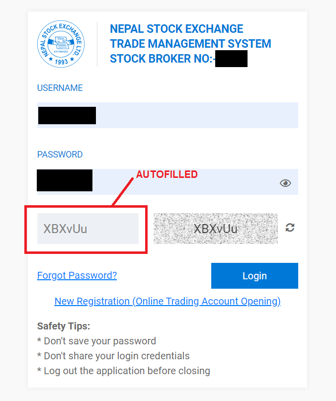

# TMS Captcha autofiller [Chrome extension]

About ten lines of JS code which make it so that you never have to manually input TMS's captcha again (at least till they change the implementation).

Read the corresponding blog post at [nirav.com.np](https://nirav.com.np/2021/05/22/the-tms-website-sucks-so-i-made-a-captcha-autofiller.html)

# Important update: 

Seems like some brokers changed their implementation of captcha system (but not mine hehehe) so it might not work for me.

## "I want this!"

**Update:** The extension is now available in [Google Extension store](https://chrome.google.com/webstore/detail/tms-captcha-autofiller/bbnmlbcjjojlcigkphmancneeplopmhg). So you can download the app from official Google channel. [Download Here](https://chrome.google.com/webstore/detail/tms-captcha-autofiller/bbnmlbcjjojlcigkphmancneeplopmhg)

Cool. Do the following:

1. Download this repo as a ZIP file (or clone it, whatever), and unzip.
2. On Google Chrome, navigate to `chrome://extensions`
3. Turn on the Developer mode (toggle switch, top right)
4. Click on the newly materialized `Load unpacked` button, and select the folder containing this repo.
5. Done! Now how're you going to spend the time you save with this extension?
